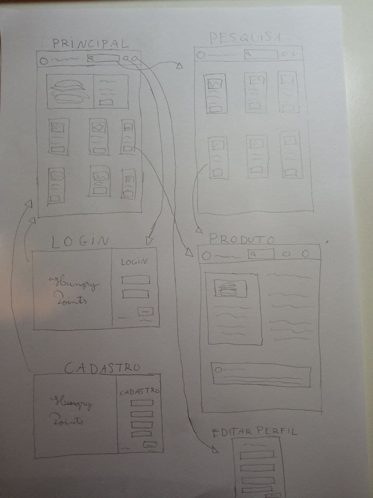
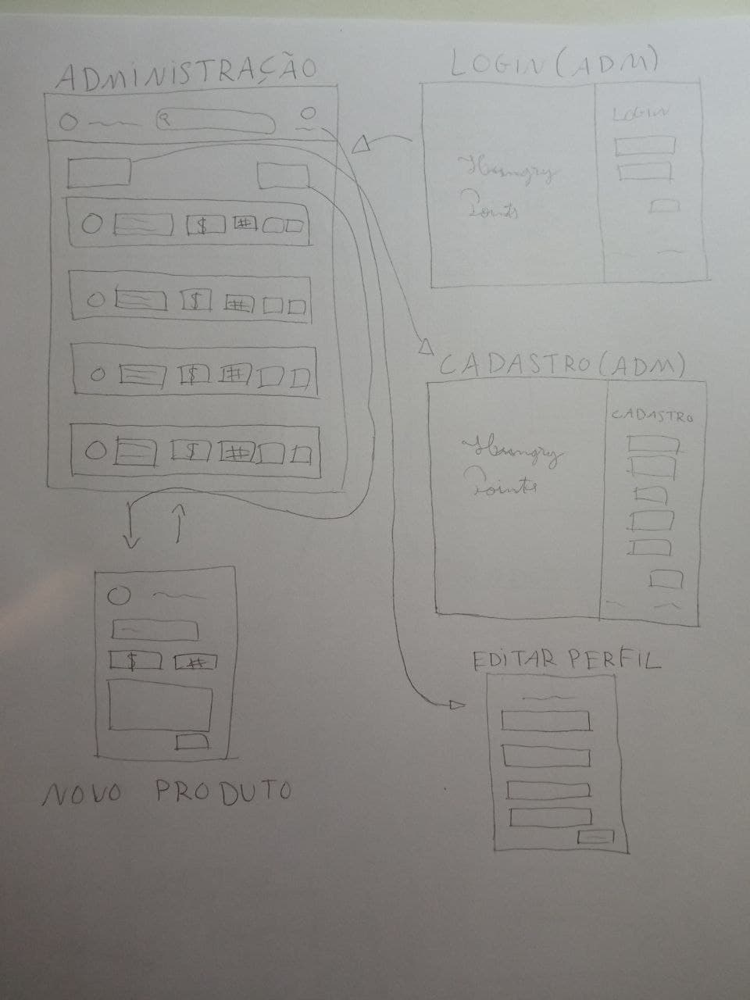
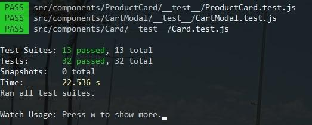

# Especificação Hungry Point

## Alunos
- Lucas Romero - 11219154
- Larissa Freire - 11207731
- Otto Fernandes - 11275130

## Requisitos do trabalho
1. O sistema deve ter 2 tipos de usuários: Clientes e Administradores
2. Os administradores são responsáveis por registrar/gerenciar administradores, clientes e produtos/serviços fornecidos. O aplicativo já vem com um administrador de conta com senha admin.
3. Clientes são usuários que acessam o sistema para comprar produtos/serviços.
4. O registro do administrador inclui, pelo menos: nome, id, telefone, e-mail.
5. O registro de cada cliente inclui, pelo menos: nome, id, endereço, telefone, e-mail
6. Os registros de produtos/serviços incluem, no mínimo: nome, id, foto, descrição, preço, quantidade (em estoque), quantidade vendida.
7. Sua loja pode vender produtos, serviços ou ambos (você decide)
8. Venda de produtos (ou serviços): os produtos são selecionados, sua quantidade escolhida e são incluídos em um carrinho. Os produtos são comprados usando um número de cartão de crédito (qualquer número é aceito pelo sistema). A quantidade de produto vendida é subtraída da quantidade em estoque e adicionada à quantidade vendida. Os carrinhos são esvaziados somente mediante pagamento ou pelos clientes.
9. Gerenciamento de produto/serviço: Os administradores podem criar/atualizar/ler/excluir (crud) novos produtos e serviços. Por exemplo, eles podem alterar a quantidade em estoque.
10. O sistema deve fornecer requisitos de acessibilidade e boa usabilidade. O sistema deve ser responsivo.
11. Nossa funcionalidade: Para os clientes mais frequentes nas compras, são enviados cupons de desconto em novas compras.

## Descrição do Projeto
Decidimos implementar uma loja online de comidas e lanches de São Carlos. A funcionalidade é semelhante a do iFood, e a interface lembra bastante a navegação da Amazon. Conforme indicam os requisitos, teremos dois tipos de usuários, os clientes e os administradores. O cliente não precisa logar no site para navegar, apenas para finalizar a compra. Nas páginas dos lanches, o cliente pode visualiar informações sobre os produtos, como nome, preço e local de venda. Pode selecionar a quantidade, e colocar observações para o restaurante/lanchonete sobre seu pedido. Além disso, a administração pode, em sua interface, realizar todas as operações descritas nos requisitos sobre lanches: visualizar, atualizar, criar ou excluir. Finalmente, nos esforçamos para dar ao usuário final uma boa usabilidaede  e interfaces responsivas. Esperamos que gostem :)

A navegação de páginas pode ser visualizada [nesse link](https://www.figma.com/file/BJsdGaZ6d1yaWfED4s2ZAM/Trabalho-de-Web?node-id=75%3A201), no Figma.

A tela inicial mostra uma série de refeições que o cliente pode comprar, e clicar em cada imagem leva o usuário à página do produto. Lá, é possível ver mais informações sobre aquele produto - ou lanche - como preço, local do restaurante/lanchonete, descrição e comentários de outros usuários. Na página inicial, também podemos fazer uma pesquisa na barra superior, e chegamos à tela de produtos. Clicando em um produto, somos guiados à tela de produto. 

Podemos acessar também as telas de cadastro e login, como mostra o diagrama.

A administração acessa sua tela de login por uma nova URL. Após logar, é mostrada uma tela onde pode pesquisar e acessar cada produto e fazer as devidas modificações. Também pode excluir um lanche e criar um novo, conforme os requisitos. 

Além disso, pretendemos salvar no servidor:
- Informações sobre o cliente, como nome, endereço e histórico de compras;
- Informações sobre os produtos, como nome, estabelecimento que o produz e preço;

## Comentários sobre o código
Nenhum comentário

## Plano de testes

Testamos nosso front-end usando a framework para teste de JavaScript Jest.

Testamos a maioria das páginas e componentes descartando páginas simplistas como de login e cadastro.

Todos os códigos dos testes feitos se encontram anexados em arquivos do tipo "__test__" nas pastas das páginas e componentes nos quais os testes foram realizados.

Caso queira testar é só executar o comando: npm test, no próprio terminal 

Ainda não decidimos sobre as ferramentas de teste para o back-end

## Resultados dos testes
Todos os testes realizados para o frontend deram resultado positivo, como ilustra o print abaixo mostrando a realização de 32 testes em 13 pastas distintas correspondentes aos componentes e páginas do app.

## Como rodar o projeto
Para rodar o projeto basta baixar esse repositório (ou cloná-lo na sua máquina).

Para facilitar a instalação de todos os pacotes do frontend e backend, em suas respectivas versões requeridas, pode-se rodar o docker para executar a aplicação.

Antes de tudo é recomendado atualizar seu sistema. Em seguida, instale com o seu gerenciador de pacote padrão o docker e o docker-compose.

Para iniciá-lo vá ao diretório principal do projeto, o trab_web, e execute o comando "sudo docker-compose up"

Para outras dúvidas consulte o link: docker-docs [nesse link](https://docs.docker.com/get-docker/), docker-docs.

Ele vai baixar o banco de dados Redis, o MongoDB, o Nodejs e outras dependências, e por isso pode levar alguns minutos até a inicialização completa na primeira vez que executar o docker.

Após isso basta abrir no seu browser uma guia no localhost da porta padrão 3000, e assim você poderá ver a aplicação em execução.
Se quiser acessar alguma página manualmente digite no broser seu caminho:
Exemplo para a página de login: http://localhost:3000/login

Você pode encontrar o caminho para todas as páginas acessando trab_web/frontend/src/routes.js

## Problemas
(FirstMilestone) Já tivemos problemas relacionados à responsividade do nosso protótipo e com o aprendizado rápido de frameworks de css. O segundo fator impacta no primeiro, fazendo com que a tela principal tenha divergências em relação ao protótipo no Figma. Para o próximo milestone, esperamos ter resolvido esse problema, dominando os frameworks de front-end e dedicando mais tempo à usabilidade das nossas páginas.

## Comentários
(Second Milestone)
- Problemas detectados no First Milestone foram resolvidos.
- Dinâmica da apresentação e busca dos produtos e das informações solicitas ao servidor foram implementadas com exemplos simplistas e repetitivos no próprio código para simular a ação do servidor.
